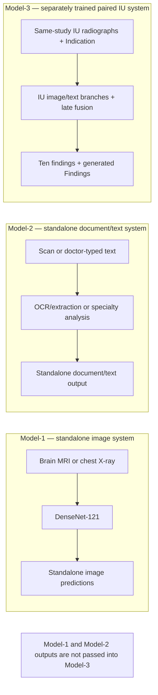

# Multimodal AI Assistant for Medical Image and Clinical Text Analysis with Paired Image–Text Fusion

> [!CAUTION]
> Retrospective research prototype only. This software is not a medical device, is not clinically validated, and must not be used for patient care or autonomous clinical decisions.

This thesis implementation evaluates three independently bounded systems: medical-image classification, clinical document/typed-text analysis, and an Indiana University (IU) same-study radiograph–Indication fusion model. Model-1 and Model-2 are **not** inputs to Model-3. Only Model-3 supports the paired multimodal claim.

[Final report](docs/final-thesis-report.pdf) · [Architecture and diagrams](docs/architecture.md) · [Datasets](docs/datasets.md) · [Reproducibility](docs/reproducibility.md) · [Results](docs/results.md) · [Responsible use](docs/responsible-use.md)

## Research-system boundaries



The numbering denotes research components, not a sequential clinical pipeline. Five detailed methodology and validation diagrams are in [docs/architecture.md](docs/architecture.md).

## Components

| System | Input | Method | Output | Evidence boundary |
|---|---|---|---|---|
| Model-1A | Brain MRI | DenseNet-121, similarity-grouped five-fold CV | Four-class probabilities | Detected exact/perceptual-similarity groups confined to folds |
| Model-1B | Chest X-ray | DenseNet-121, nested patient-wise five-fold CV | Fourteen-label probabilities | Zero patient overlap; thresholds selected on inner validation |
| Model-2A | Scanned prescription/lab report | Image preparation, OCR, cleaning, rules | OCR text and JSON | Processing coverage only; no expert semantic reference |
| Model-2B | Doctor-typed text | Specialty classifier; separate weak-label entity module | Specialty/entity output | Held-out specialty labels or disclosed weak labels |
| Model-3 | Same-study IU X-rays + Indication | Three-seed DenseNet-121, word/character TF–IDF logistic regression, 0.75/0.25 fusion | Ten probabilities and template Findings | Development-only selection; one locked 352-study evaluation |

## Verified headline results

| Component | Final result |
|---|---|
| Model-1A Brain MRI | Accuracy **0.9317 ± 0.0168**; macro F1 **0.9316 ± 0.0169**; macro AUROC **0.9905 ± 0.0011**; 7,200 OOF predictions |
| Model-1B Chest X-ray | Macro AUROC **0.7746 ± 0.0044**; tuned macro F1 **0.2229 ± 0.0031**; 112,120 OOF images from 30,805 patients |
| Model-2A documents | OCR/entity-field/structured-output completion **1.0000 / 0.8755 / 1.0000** over 241 records |
| Model-2B specialty | Accuracy/macro F1/weighted F1 **0.3209 / 0.3468 / 0.2962** on 969 held-out records |
| Model-2B weak entities | Token accuracy **0.9937**; entity F1 **0.0148** |
| Model-3 image only | Macro AUROC/AUPRC/F1 **0.7910 / 0.3064 / 0.2915** |
| Model-3 Indication only | Macro AUROC/AUPRC/F1 **0.6282 / 0.1257 / 0.1442** |
| Model-3 late fusion | Macro AUROC/AUPRC/F1 **0.7954 / 0.3107 / 0.3071**; micro F1 **0.3295** |
| Findings generation | ROUGE-1/2/L **0.4569 / 0.3692 / 0.4895** on 352 locked studies |

Fusion produced the highest locked-test point estimates, but fusion-minus-image 95% confidence intervals crossed zero for macro AUROC, AUPRC, and F1. The cohort did not establish statistically clear superiority over image-only prediction. Model-2A values measure completion, not transcription correctness. Model-2B entities measure weak-label agreement. ROUGE measures lexical overlap, not clinical correctness.

## Installation

Python 3.11 or 3.12 is recommended. GPU training requires a locally compatible PyTorch/CUDA installation; tests are CPU-only. Tesseract-based OCR also requires Tesseract installed on `PATH`.

```bash
python -m venv .venv
```

Windows PowerShell:

```powershell
.\.venv\Scripts\Activate.ps1
python -m pip install --upgrade pip
pip install -r requirements.txt
```

Linux/macOS:

```bash
source .venv/bin/activate
python -m pip install --upgrade pip
pip install -r requirements.txt
```

## Data and checkpoints

Datasets and weights are deliberately excluded. Obtain them under their original terms and arrange repository-relative `data/`, `checkpoints/`, and `outputs/` directories as described in [docs/datasets.md](docs/datasets.md). These roots are ignored by Git. No test downloads medical data or a pretrained model.

## Commands

Safe CLI inspection:

```bash
python -m src.run_case --help
python -m src.iu_paired.run --help
```

The thesis-selected Model-3 implementation is under `src/iu_paired_improved/`. Its final stage is artifact-dependent, GPU-oriented, and must not be used to retune against locked labels:

```bash
python -m src.iu_paired_improved.final_pipeline
```

See [the reproducibility guide](docs/reproducibility.md) before running any phase.

Standalone case execution:

```bash
python -m src.run_case --case_id case_001 --image path/to/image.png --image_modality xray --document path/to/document.pdf
```

Component demonstration UI:

```bash
streamlit run app.py
```

The Streamlit app is an inherited technical component demonstration. It is not evidence that Model-1 and Model-2 feed the final paired Model-3 architecture.

## Tests

```bash
pip install -r requirements-dev.txt
python -m compileall -q src tests
pytest -q
```

## Layout

```text
app.py                         component demonstration UI
docs/                          thesis, diagrams, data, results, safeguards
scripts/                       audits, figures, and report-support utilities
src/model1/                    standalone medical-image system
src/model2/                    standalone scan/typed-text system
src/model3/                    earlier general fusion/RAG prototypes
src/iu_paired/                 first paired IU implementation and helpers
src/iu_paired_improved/        thesis-selected locked-test implementation
src/iu_paired_rescue/          development-only follow-up experiments
tests/                         dataset-free methodology and schema tests
```

`src/iu_paired_rescue/` is retained for provenance but did not reopen the final test and is not the selected locked-test result.

## Limitations

- No prospective, independent-hospital, clinician-rated, or deployment evaluation.
- Brain MRI grouping cannot prove patient independence.
- ChestXray14 labels are automatically mined and imbalanced.
- Model-2A lacks expert-corrected transcripts and field annotations.
- Model-2B entities use weak references.
- IU separation is study-wise; repeat patients cannot be excluded.
- ROUGE can reward template wording without establishing factual safety.

## Citation and license status

See [CITATION.cff](CITATION.cff) and the final report for authorship and dataset references.

No reuse license has currently been selected. All rights are reserved unless a license is added later.
