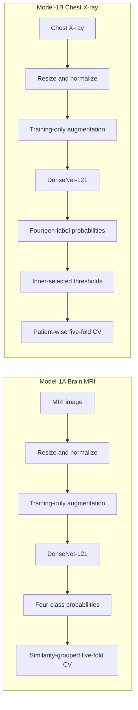
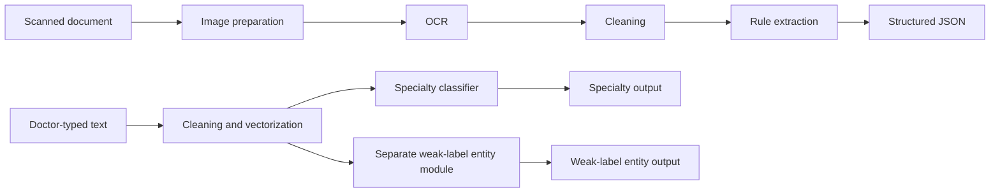
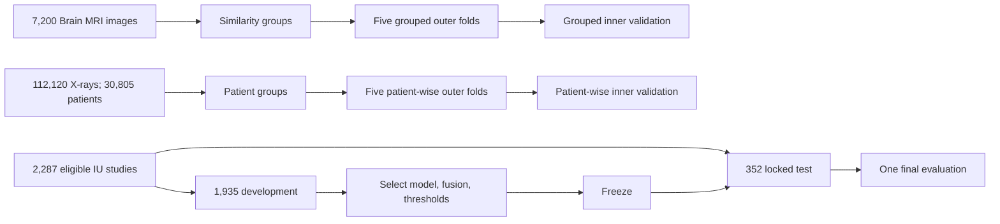

# Architecture and methodology

The thesis evaluates three independently bounded systems. Model-1 and Model-2 outputs are not passed into Model-3.

## Model-1



Model-1A confines detected exact/perceptual-similarity components to folds. Model-1B uses patients as both outer- and inner-split units.

## Model-2



Processing completion is not expert semantic accuracy, and weak-label agreement is not clinician-verified entity recognition.

## Model-3 paired IU architecture

```mermaid
flowchart TB
  U[One eligible IU study] --> I[Study radiograph projection(s)]
  U --> T[Same-study Indication]
  I --> IE[Three-seed ImageNet DenseNet-121 ensemble] --> PI[p_image]
  T --> TF[Word + character TF-IDF] --> LR[Ten one-vs-rest logistic regressions] --> PT[p_text]
  PI --> F[p_fusion = 0.75 p_image + 0.25 p_text]
  PT --> F
  F --> TH[Development-selected thresholds] --> L[Ten predicted findings] --> G[Training-derived frozen templates] --> GF[Generated Findings]
  H[Hidden same-study Findings] --> R[ROUGE evaluation only]
  GF --> R
  Q[Findings and Impression never enter predictor branches] -. safeguard .-> H
```

The image seeds are 42, 123, and 2026. Reference Findings and Impression remain hidden until after prediction and generation.

## Validation and leakage controls



IU separation is study-wise because a stable patient identifier was unavailable. Repeat patients cannot be excluded.

## Code provenance

- `src/iu_paired_improved/`: thesis-selected locked-test implementation.
- `src/iu_paired/`: earlier paired implementation and shared helpers.
- `src/iu_paired_rescue/`: development-only follow-up experiments; no new final-test claim.
- `src/model3/`: earlier general fusion/RAG prototype, not the IU locked-test architecture.
